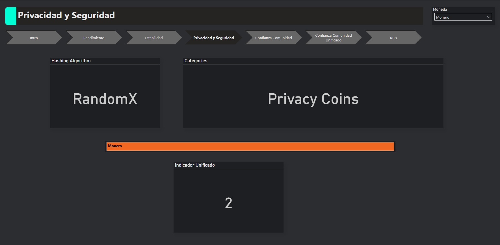
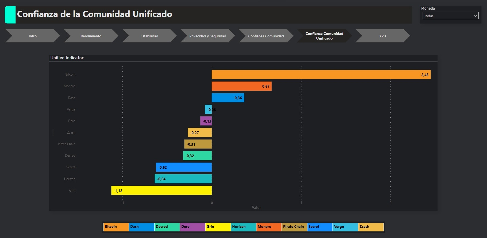
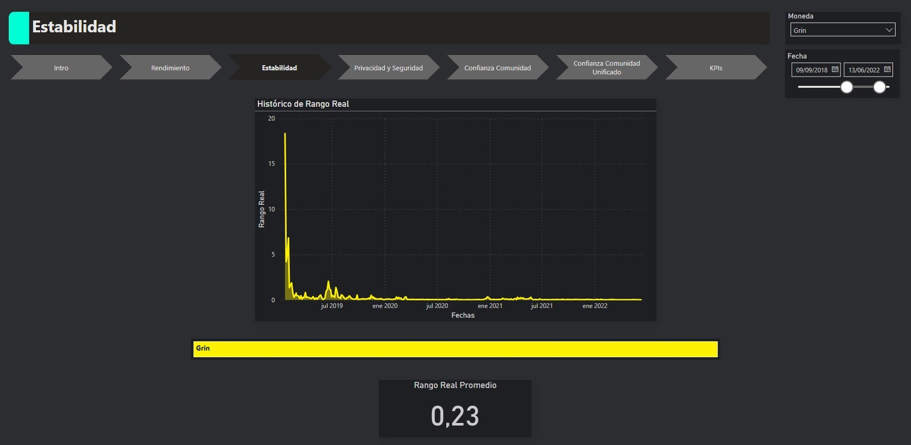
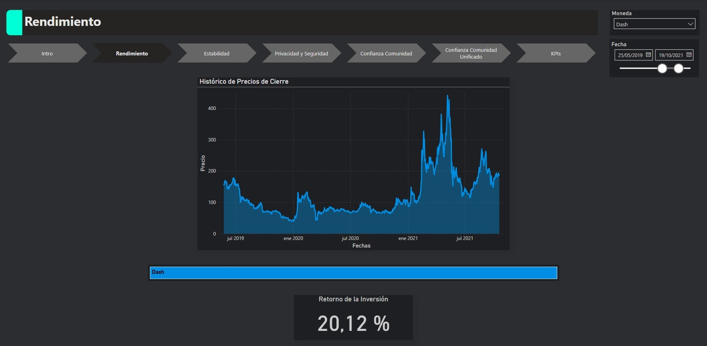
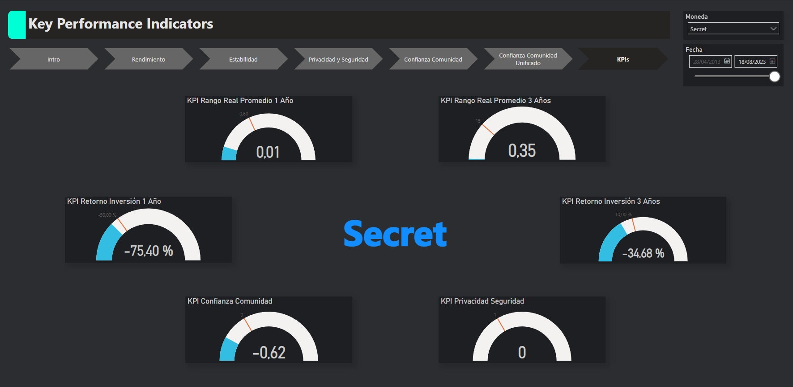

# <h1 align=center> **PROYECTO INDIVIDUAL Nº2** </h1>

# <h1 align=center>**Cryptocurrency Market Data Analytics**</h1>

  

### En este segundo proyecto individual, el desafío es desen***crypt***ar información relativa al mundo de las monedas digitales y convertirla en un activo en la toma de decisiones.
 

  <a href="https://github.com/MarFloCaro" style="color: silver; text-decoration: none;">
    by Maria Florencia Caro, Cohorte 13
  </a>

# <h1 align=center> **Intro** </h1>

Partiendo de un EDA, vamos a conocer qué datos nos proporcionan algunas de las empresas proveedoras de datos de criptomonedas más populares, para decidir, con un conjunto limitado de las mismas, qué cuestiones profundizar en nuestro análisis. Nuestro producto final será un tablero o dashboard mostrando nuestros hallazgos y proponiendo cursos de acción a nuestro cliente.

# <h1 align=center> **Desarrollo del Proyecto**</h1>

## Selección de Monedas

La elección de las criptomonedas se basó en su particularidad de ser consideradas "privacy coins", es decir, criptomonedas diseñadas para enfocarse en la privacidad y confidencialidad de las transacciones. Estas criptomonedas han ganado un lugar destacado en el mundo de las finanzas digitales debido a su enfoque en proteger la identidad y datos personales de los compradores durante las transacciones en línea. Consideramos que el hipotético cliente ha venido a nosotros planteando sus inquietudes en temas de seguridad y privacidad, y estas criptomonedas están diseñadas específicamente para abordar las mismas.

Partimos de la selección de "Bitcoin", criptomoneda pionera y más conocida en el mundo, muchas veces utilizada a modo de patrón; mientras que agregamos "Monero", "Zcash", "Dash", "Horizen", "Verge", "Grin", "Pirate Chain", "Decred", "Dero" y "Secret" al conjunto, ya que han surgido como alternativas con enfoque en la privacidad. Su selección por sobre otras de similares características fue el resultado de analizar numerosas publicaciones en línea, como foros, blogs y artículos, que abordaban las criptomonedas centradas en la privacidad. Estas criptomonedas se destacaron como las más mencionadas y discutidas en dicho contexto.

## Tecnologías y métodos utilizados

Todo el proceso de extracción de datos está desarrollado en el archivo producido a tal fin, [Endpoints Script de Python](/endpoints.py), el cual fue utilizado como librería de funciones durante el EDA y otras etapas de extracción de datos (para posterior uso en el Dashboard). Consta de varias funciones que utilizan API Endpoints de CoinGecko y CoinMarketCap.

El EDA, además de valerse de estas funciones, utiliza varias librerías de Python, como Pandas, Numpy, Seaborn, MatPlotLib y Wordcloud. También se utilizó Sklearn en el archivo dedicado a la [reducción de la dimensionalidad](dimensionalidad_seguridad.ipynb), para elaborar un índice simplificado que refleje la percepción de la comunidad, presentado como métrica y también KPI dentro del Dashboard. En este útimo archivo también se procesó información categórica para convertirla en numérica, a fin de elaborar métricas y KPIs.

Finalmente, se utilizó Power BI para la construcción del Dashboard y gráficos de análisis de los hallazgos. Se produjeron diversas métricas en base a valores de columnas propias del dataset o calculadas.

## Focos de Análisis

Luego de una elaborada lectura para formar una idea respecto a factores de importancia, enfocamos el estudio en 4 premisas:

### Privacidad y Seguridad

La información presente en la recopilación incluye el algoritmo de hashing que utiliza cada moneda, y también algunas etiquetas con referencia a categorías a las cuales pertenecen las mismas. Utilicé la repitencia de términos indicativos de privacidad y seguridad como medida de evaluación, un método muy simple: A mejor algoritmo, mayor puntaje; también agregando puntaje a las menciones de Zero Knowledge. Esto dio lugar a una columna llamada privacy_score.

  

### Confianza de la Comunidad

Luego del EDA, y notando una serie de scores, rankings y datos categóricos dentro de la información extraída, decidí elaborar medidas/índices que me permitieran analizar la confianza de la comunidad crypto. Convertí la ponderación de los brokers/operadores de crypto que utiliza un indicador de tipo semáforo (🟢 verde, 🟡 amarillo, 🔴 rojo) en números enteros, y agregué una columna a mi dataframe de Pandas. 

En el siguiente paso, luego de analizar correlaciones y redundancias, seleccioné los scores y rankings, incluido este último de elaboración propia; y los sometí a un proceso de reducción de dimensionalidad usando librerías de ML, para poder obtener un único dato representativo de todas las columnas. Finalmente exporté el dataframe actualizado para uso en el dashboard, con el dato de Privacidad/Seguridad en él.

  

### Estabilidad

Usando el endpoint OHLC (Opening, High, Low, Close; por Apertura, Alto, Bajo, Cierre), agregué una columna como paso intermedio para una medida llamada Average True Range (Rango Medio Verdadero), que en mi lectura se presentaba como medida de volatibilidad de una moneda, con énfasis en la granularidad (toma datos de TODAS las mediciones de OHLC dentro de un período/rango). Esta columna, llamada true range, se calcula tomando el valor máximo entre:
*   Alto menos Bajo
*   Valor absoluto Alto menos Cierre del período anterior
*   Valor absoluto Bajo menos Cierre del período anterior

El Average True Range es la sumatoria del valor seleccionado de ese proceso por cada día/punto medido, dividido la cantidad.

ATR = $\frac{\sum{\text{True Range}}}{\text{n}}$

En el dashboard podemos observar la medida de ATR aplicada por moneda para cualquier fecha dentro del dataset donde la moneda exista.

  

### Rendimiento

Para medir el rendimiento y la rentabilidad, se elaboró una medida de ROI (Return of Investment, o Retorno de la Inversión). Esta medida es mucho menos granular, y plantea sólo dos fechas de análisis. Téngase en cuenta que como no estamos analizando montos invertidos, la medida consiste en:

ROI = $\frac{\text{Precio Actual}-\text{Precio Inicial}}{\text{Precio Inicial}}$

Al igual que el ATR, el ROI también ofrece posibilidad de observarse por intervalos seleccionados dentro del dashboard para la moneda elegida.

  

## KPIs (presentados por moneda seleccionada y fechas según detalle)

Se elaboraron KPIs con foco en 3 áreas:
* Privacidad, Seguridad y Confianza de la Comunidad
* Estabilidad
* Rendimiento

### Privacidad, Seguridad y Confianza de la Comunidad

* Se elaboró un KPI de Sentimiento de la Comunidad, basado el índice unificado elaborado en el paso de análisis, agregando un objetivo. 
* Se elaboró un KPI de Privacidad basado en la columna privacy_score, agregando un objetivo.

Ambos índices de base son estáticos y se calculan utilizando la última fecha dentro del dataset (no se encuentran los datos que los originan dentro de los endpoints de datos históricos)

### Estabilidad

* Se elaboraron dos KPIs con base al ATR, agregando un objetivo, con diferentes rangos de tiempo. Ambos son dinámicos, parten de una fecha seleccionada y retroceden 1 ó 3 años, respectivamente; siempre y cuando haya datos para esas fechas.

### Rendimiento

* Se elaboraron sendos KPIS en base al ROI, agregando un objetivo, con los mismos intervalos de tiempo planteados en los de estabilidad.

  

# <h1 align=center> **Conclusiones y Recomendaciones**</h1>

En ocasión de reunirse con el cliente, la idea es presentar datos y gráficos del análisis para plantear un panorama donde, con los KPIs elaborados como base, se opte por uno de estos escenarios:

* Con KPIs de seguridad y confianza adecuados, elegir una opción que no tenga un rendimiento demasiado destacado, pero que plantee baja volatilidad, a modo de equivalente de ahorro en moneda constante.
* Nuevamente con seguridad y confianza adecuados, tolerar mayor volatilidad en pos de buscar mayor rendimiento para realizar una inversión en lugar de un ahorro.
* Una combinación de ambos, dividiendo el dinero disponible entre éstos.

# <h1 align=center> **Entregables**</h1>

## Índice de Archivos del Repo

+ [EDA Jupyter Notebook](eda.ipynb)
+ [Endpoints Script de Python](endpoints.py)
+ [Reducción Dimensionalidad Sentiments y Score Seguridad Jupyter Notebook](dimensionalidad_seguridad.ipynb)
+ [Generación de Archivos CSV para Dashboard +  columna True Range Jupyter Notebook](data_export.ipynb)
+ [Crypto Coins Analytics - PowerBI](CryptoCoinsAnalytics.pbix)

## Fuentes de datos principales

Las fuentes consultadas fueron online y no hay archivos relacionados en el repositorio; destacándose los endpoints API gratuitos de los siguientes proveedores de datos en línea:

+ [CoinGecko](https://www.coingecko.com/)
+ [CoinMarketCap](https://coinmarketcap.com/)
