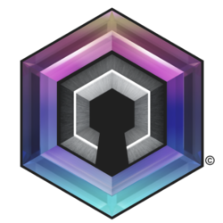
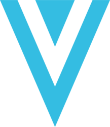
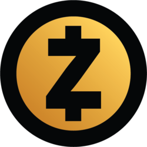

# <h1 align=center> **PROYECTO INDIVIDUAL Nº2** </h1>

# <h1 align=center>**Cryptocurrency Market Data Analytics**</h1>

  

### En este segundo proyecto individual, el desafío es desen***crypt***ar información relativa al mundo de la las monedas digitales y convertirla en un activo en la toma de decisiones.
 

  <a href="https://github.com/MarFloCaro" style="color: silver; text-decoration: none;">
    by Maria Florencia Caro, Cohorte 13
  </a>

# <h1 align=center> **Intro** </h1>

Partiendo de un EDA, vamos a conocer qué datos nos proporcionan algunas de las empresas proveedoras de datos de criptomonedas más populares, para decidir, con un conjunto limitado de las mismas, qué cuestiones profundizar en nuestro análisis. Nuestro producto final será un tablero o dashboard mostrando nuestros hallazgos y proponiendo cursos de acción a nuestro cliente.

# <h1 align=center> **Desarrollo del Proyecto**</h1>

## Selección de Monedas
 

    
    
    
    
    
    
    
    
    
    
    

 

La elección de las criptomonedas se basó en su particularidad de ser consideradas "privacy coins", es decir, criptomonedas diseñadas para enfocarse en la privacidad y confidencialidad de las transacciones. Estas criptomonedas han ganado un lugar destacado en el mundo de las finanzas digitales debido a su enfoque en proteger la identidad y datos personales de los compradores durante las transacciones en línea. Consideramos que el hipotético cliente ha venido a nosotros planteando sus inquietudes en temas de seguridad y privacidad, y estas criptomonedas están diseñadas específicamente para abordar las mismas.

Partimos de la selección de "Bitcoin", criptomoneda pionera y más conocida en el mundo, muchas veces utilizada a modo de patrón; mientras que agregamos "Monero", "Zcash", "Dash", "Horizen", "Verge", "Grin", "Pirate Chain", "Decred", "Dero" y "Secret" al conjunto, ya que han surgido como alternativas con enfoque en la privacidad. Su selección por sobre otras de similares características fue el resultado de analizar numerosas publicaciones en línea, como foros, blogs y artículos, que abordaban las criptomonedas centradas en la privacidad. Estas criptomonedas se destacaron como las más mencionadas y discutidas en dicho contexto.

## Tecnologías y métodos utilizados

Todo el proceso de extracción de datos está desarrollado en el archivo producido a tal fin, [Endpoints Script de Python](/endpoints.py), el cual fue utilizado como librería de funciones durante el EDA y otras etapas de extracción de datos (para posterior uso en el Dashboard). Consta de varias funciones que utilizan API Endpoints de CoinGecko y CoinMarketCap.

El EDA, además de valerse de estas funciones, utiliza varias librerías de Python, como Pandas, Numpy, Seaborn, MatPlotLib y Wordcloud. También se utilizó Sklearn en el archivo dedicado a la [reducción de la dimensionalidad](reduccion_dimensionalidad.ipynb) utilizado para elaborar un índice simplificado que refleje la percepción de la comunidad, presentado como métrica y también KPI dentro del Dashboard. 

Finalmente, se utilizó Power BI para la construcción del Dashboard y gráficos de análisis de los hallazgos.

# <h1 align=center> **Conclusiones**</h1>

## 

# <h1 align=center> **Entregables**</h1>

## Índice de Archivos del Repo

+ [EDA Jupyter Notebook](/eda.ipynb)
+ [Endpoints Script de Python](/endpoints.py)
+ [Reducción Dimensionalidad Sentiments Jupyter Notebook](reduccion_dimensionalidad.ipynb)

## Fuentes de datos principales

+ [CoinGecko](https://www.coingecko.com/)
+ [CoinMarketCap](https://coinmarketcap.com/)